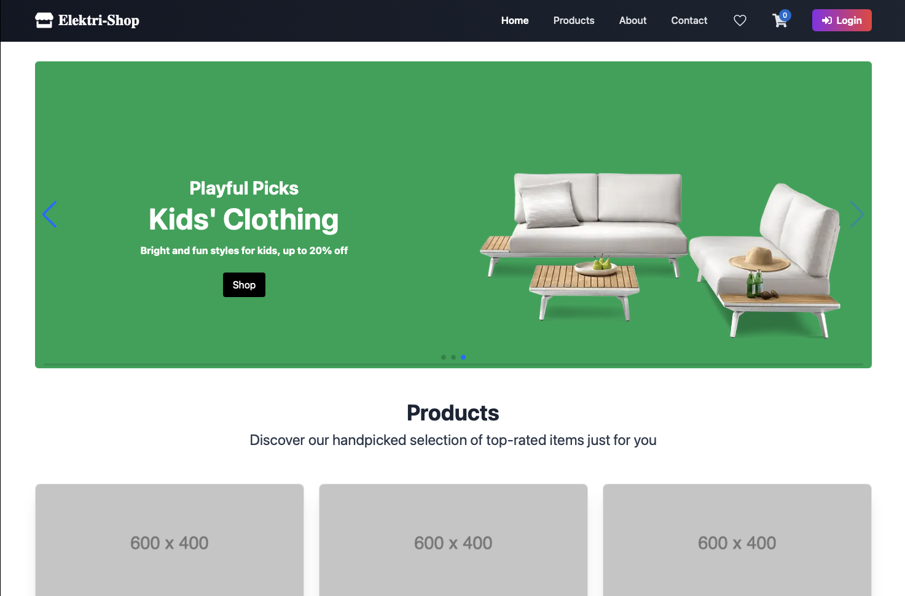
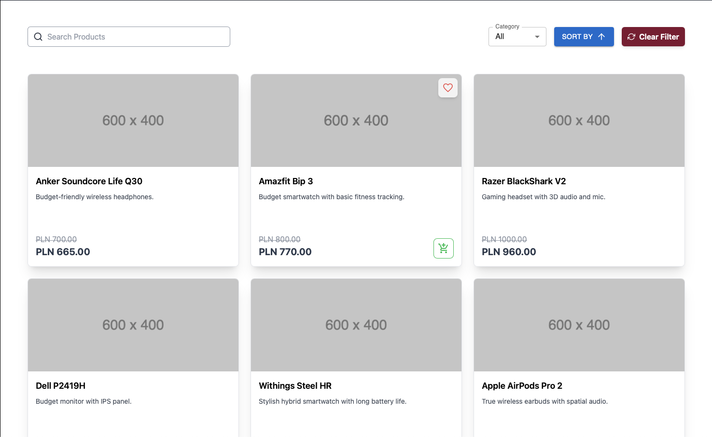
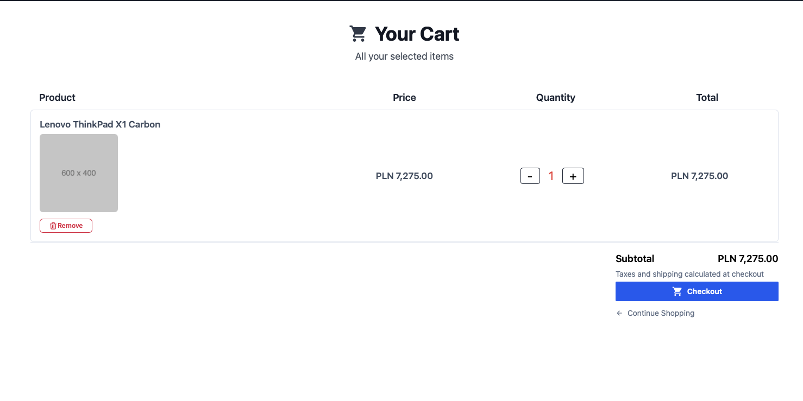
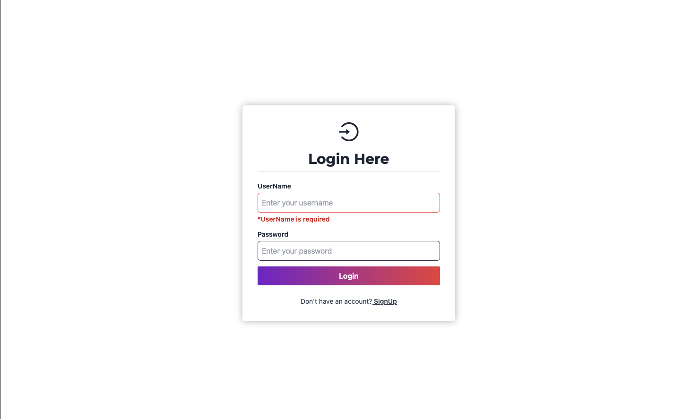

# ⚡ ElectriShop – sklep internetowy z elektroniką

ElectriShop to pełnoprawna aplikacja e-commerce do sprzedaży elektroniki. Umożliwia rejestrację i logowanie użytkowników, przeglądanie produktów, zarządzanie koszykiem, składanie zamówień oraz panel administratora do zarządzania produktami i zamówieniami.

## ✨ Kluczowe funkcjonalności

- 🔐 Rejestracja i logowanie użytkowników (JWT)
- 🛍️ Przeglądanie produktów według kategorii
- 🧺 Dodawanie i usuwanie produktów z koszyka
- 💳 Integracja z płatnościami (Stripe)
- 🖼️ Wgrywanie i wyświetlanie zdjęć produktów (Cloudinary)
- 📦 Panel administratora do zarządzania produktami i zamówieniami

---

## 🖼️ Zrzuty ekranu

### 🏠 Strona główna

### 🛒 Lista produktów

### 🛒 Lista produktów w karcie 

### ⚙️ Panel logowania

---

## 🔧 Technologie

### Backend (Spring Boot)
- Java 21
- Spring Boot + Spring Security (JWT)
- PostgreSQL
- Docker + Docker Compose

### Frontend (React)
- React 18 + Vite
- Tailwind CSS
- Redux
- Axios

---

## 🚀 Demo aplikacji

💻 [Frontend – wersja demo](https://twoj-link-do-frontendu.com)  
🔧 [Backend – Swagger UI](https://twoj-link-do-backendu.com/swagger-ui/index.html)

---

## 🛠️ Jak uruchomić projekt?

Przejdź do folderu `backend` lub `frontend` i przeczytaj instrukcję (`README.md`), aby dowiedzieć się, jak uruchomić projekt lokalnie.

Każdy z modułów (backend i frontend) zawiera osobne kroki konfiguracji oraz uruchomienia.

